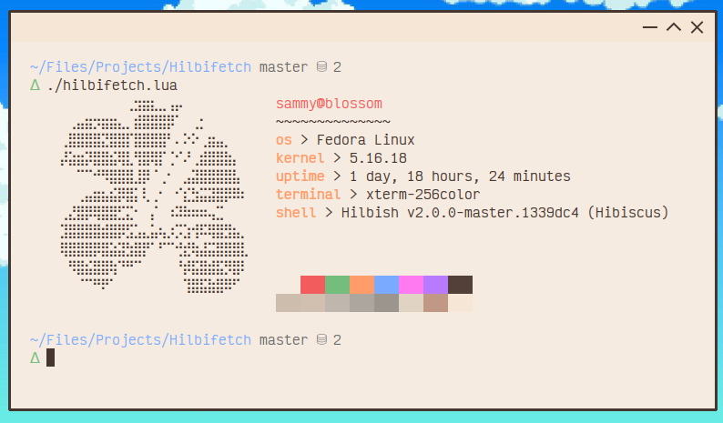

<h1>Hilbifetch</h1>
<blockquote>Simple and small fetch written in Lua.</blockquote>

Hilbifetch is your average system info fetch inspired by Neofetch, my own
[Bunnyfetch](https://github.com/Luvella/Bunnyfetch) and the others.  
But this time, it's written and configured in Lua.

# Setup
> Hilbifetch is in a very early state, expect it to look weird or have odd bugs.

Hilbifetch requires you have `ansikit`, which is provided in Hilbish by default.  
Which means you'll either have to manually put ansikit in Lua's require directory
or use in Hilbish.

# Usage
`lua hilbifetch.lua`  
Or within Hilbish, `dofile 'hilbifetch.lua'`

# License
Hilbifetch is licensed under the BSD 3-Clause license.  
[Read here](LICENSE) for more info.
